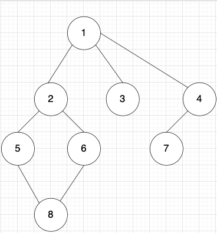

## BFS(너비 우선 탐색) & DFS (깊이 우선 탐색)

#### 1. BFS (너비 우선 탐색)

> 특정 노드부터 시작해 가까운 노드부터 탐색하는 방식
>
> - 특징
>   - 시작 노드의 가장 가까운 노드부터 가장 먼 노드 순으로 모든 노드 탐색
>   - 노드의 수가 적고 깊이가 얕은 경우 `빠르게 동작`
>   - 거리순으로 노드를 탐색, `최단경로` 가 존재한다면 반드시 찾음
>   - 큐를 활용해서 탐색할 노드의 순서를 저장하고 큐에 저장된 순서대로 탐색 - 노드의 수가 많을 수록 더 큰 저장공간이 필요
> - 원리
>   - 시작 노드를 탐색, 인접 노드를 `Queue`에 삽입
>   - Loop : while(queue.isNotEmpty())
>   - `Queue`의 가장 앞에 있는 노드를 꺼내 탐색
>   - 방문하지 않은 노드들을 `Queue`에 `push`
>   - 

<p align="center"></p>

```kotlin
import java.util.*

/**
 * BFS - Graph
 * Array<IntArray> 확장함수 사용
 */
internal fun Array<IntArray>.bfs(start: Int, visited: BooleanArray) {
    val graph = this
    val queue = LinkedList<Int>()

    queue.offer(start) // 시작할 노드 번호
    visited[start] = true // 시작노드 방문처리

    while (queue.isNotEmpty()) {
        val x = queue.poll() // 첫번째 값 반환 후 remove
        println("x : $x")

        for (y in graph[x]) {
            if (!visited[y]) {
                queue.offer(y)
                visited[y] = true
            }
        }
    }
}

fun main() {
    val graph = arrayOf(
        intArrayOf(1),
        intArrayOf(2, 3, 4),
        intArrayOf(1, 5, 6),
        intArrayOf(1),
        intArrayOf(1, 7),
        intArrayOf(2, 8),
        intArrayOf(2, 8),
        intArrayOf(4),
        intArrayOf(5, 6),
    )

    val visited = BooleanArray(graph.size)
    graph.bfs(0, visited)
}
```

